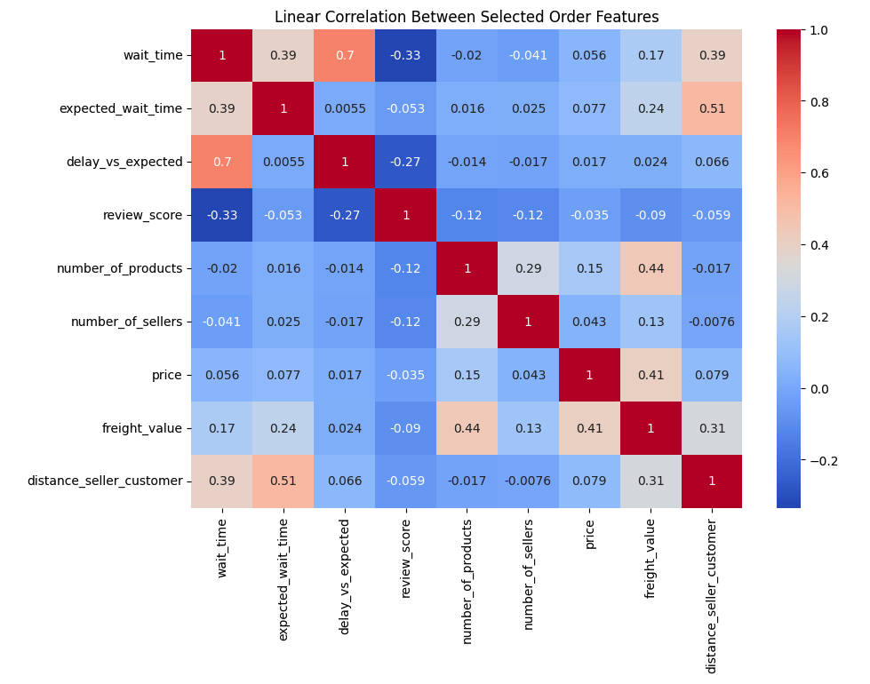

# Ecommerce Analysis

##  1. CONTEXT:

### 1.1 Problem Statement

How can Olist improve it's profit?
What are the key factors that are driving profit down?

### 1.2 Who is Olist?
Olist is a leading e-commerce service that connects small businesses across Brazil to major marketplaces, enabling them to sell products through the Olist store and ship via partner logistics. 

Olist charges sellers a monthly subscription and a fee per order.

### 1.3 Dataset

Dataset contains information on 100k orders from 2016 to 2018 made on Olist, covering various aspects such as order status, price, review scores, products, payment methods, payment and freight performance, etc. 

The schema below represents each dataset and which key to use to join them:

[For more details on the dataset please click here.](data/README.md)

Data Source: https://www.kaggle.com/datasets/olistbr/brazilian-ecommerce/data

### 1.4 P&L Rules

**Revenues:**
- **Sales fee:** Olist takes 10% cut on the product price (excl. freight) of each order delivered
- **Subscription fees:** Olist charges 80 BRL by month per seller

**Reputation Cost:** 
In the long term, bad customer experience has business implicatins: low repeat rate, immediate customer support cost, refunds or unfavourable word of mouth communication. Below are the estimate measure of the monetary cost for each bad review. 

Cost associated with bad reviews. (1-star = 100 BRL, 2-star = 50 BRL, 3-star = 40 BRL)

**IT Cost:**

Olist's total cumulated IT Costs scale with the square root of the total number of sellers that has joined the platform, as well as the square root of the total cumulated number of items that were ever sold.

$$
IT costs = \alpha \cdot \sqrt{n\_sellers} + \beta \cdot \sqrt{n\_items}
$$

Olist's data team gave us the following values for these scaling parameters:

𝛼=3157.27 𝛽=978.23 

💡 The number of sellers and products are costly for IT systems. \
💡 Yet square roots reflect scale-effects: IT-system are often more efficient as they grow bigger. \
💡 Alpha > Beta means that Olist has a lower IT Cost with few sellers selling a lot of items rather than the opposite 

## 2. DATA ANALYSIS
- <a href="#Initial_Analysis_on_Financial_Performance">**1. Initial Analysis on Financial Performance**</a>
- <a href="#Feature_Engineering">**2. Feature Engineering**</a>
- <a href="#eda">**3. Exploratory Data Analysis**</a>
    - Q. Which order features are impacting review scores?
    - Q. Which seller features are impacting review scores?
    - Q. Which product features are impacting review scores?
    - Q. Are customerse really disappointed about certain products, regardless of slow delivery time?
    - Q. What happens if we remove the worst performing sellers?
- <a href="#conclusion">**4. Conclusion/Recommendations**</a>

    
## 2.1 Initial Analysis on Financial Performance 

Gross Profit is around **668K BRL**.

Total Revenue is around **2.8M BRL** - well diversified with around half from subscription and around half from sales.

Reptuation Costs are very damaging as it makes up of more than 76% of total costs currently, and drives risk of losing more customers in the future. 

**It is essential to identify the key factors contributing to low review scores, as these factors subsequently lead to increased reputation costs.**

    
## 2.2 Feature Engineering

Goal was to develop additional features related to orders, products, and sellers, to run further analysis on what exactly are driving low review scores and how we can eliminate them. 

### Orders

👉 Created the `get_training_data` method in [olist/order.py](olist/order.py) which returns a DataFrame with the following features:

| feature_name              | type  | description                                                                 |
|:--------------------------|:-----:|:----------------------------------------------------------------------------|
| `order_id`                | str   | the id of the order                                                         |
| `wait_time`               | float | the number of days between order_purchase_timestamp and order_delivered_customer_date |
| `expected_wait_time`      | float | the number of days between order_purchase_timestamp and estimated_delivery_date |
| `delay_vs_expected`       | float | if the actual order_delivered_customer_date is later than the estimated delivery date, returns the number of days between the two dates, otherwise return 0 |
| `order_status`            | str   | the status of the order                                                     |
| `dim_is_five_star`        | int   | 1 if the order received a five-star review, 0 otherwise                     |
| `dim_is_one_star`         | int   | 1 if the order received a one_star, 0 otherwise                             |
| `review_score`            | int   | from 1 to 5                                                                 |
| `number_of_products`      | int   | number of products that the order contains                                  |
| `number_of_sellers`       | int   | number of sellers involved in the order                                     |
| `price`                   | float | total price of the order paid by customer                                   |
| `freight_value`           | float | value of the freight paid by customer                                       |
| `distance_customer_seller`| float | the distance in km between customer and seller (optional)                   |

### Sellers

👉 Created the `get_training_data` method in [olist/seller.py](olist/seller.py) which returns a DataFrame with the following features:

| feature_name          | type   | description                                                              |
|-----------------------|--------|--------------------------------------------------------------------------|
| `seller_id`           | str    | the id of the seller **UNIQUE**                                           |
| `seller_city`         | str    | the city where seller is located                                          |
| `seller_state`        | str    | the state where seller is located                                         |
| `delay_to_carrier`    | float  | returns 0 if the order is delivered before the shipping_limit_date, otherwise the value of the delay |
| `wait_time`           | float  | average wait_time (duration of deliveries) per seller                     |
| `date_first_sale`     | datetime | date of the first sale on Olist                                         |
| `date_last_sale`      | datetime | date of the last sale on Olist                                          |
| `months_on_olist`     | float  | round number of months on Olist                                           |
| `share_of_five_stars` | float  | share of five-star reviews for orders in which the seller was involved     |
| `share_of_one_stars`  | float  | share of one-star reviews for orders in which the seller was involved      |
| `review_score`        | float  | average review score for orders in which the seller was involved           |
| `n_orders`            | int    | number of unique orders the seller was involved with                      |
| `quantity`            | int    | total number of items sold by this seller                                 |
| `quantity_per_order`  | float  | average number of items per order for this seller                         |
| `cost_of_review`  | float  | total reputaion cost due to bad reviews                       |
| `sales`               | float  | total sales associated with this seller (excluding freight value) in BRL   |
| `revenues`               | float  | total revenue contribution to Olist that is associated with this seller  |
| `profits`               | float  | total profit contribution to Olist that is associated with this seller   |

### Products

👉 Created the `get_training_data` method in [olist/product.py](olist/product.py) which returns a DataFrame with the following features:

| feature_name                  |  type   | description                                                                |
|:------------------------------|:-------:|:---------------------------------------------------------------------------|
| `product_id`                  |   str   | id of the product **UNIQUE**                                               |
| `category`                    |   str   | category name (in English)                                                 |
| `product_name_length`         |  float  | number of characters of a product name                                     |
| `product_description_length`  |  float  | number of characters of a product description                              |
| `product_photos_qty`          |   int   | number of photos available for a product                                   |
| `product_weight_g`            |  float  | weight of the product                                                      |
| `product_length_cm`           |  float  | length of the product                                                      |
| `product_height_cm`           |  float  | height of the product                                                      |
| `product_width_cm`            |  float  | width of the product                                                       |
| `price`                       |  float  | average price at which the product is sold                                 |
| `wait_time`                   |  float  | average wait time (in days) for orders in which the product was sold       |
| `share_of_five_stars`         |  float  | share of five-star review scores for orders in which the product was sold  |
| `share_of_one_stars`          |  float  | share of one-star review scores for orders in which the product was sold   |
| `review_score`                |  float  | average review score of the orders in which the product was sold           |
| `n_orders`                    |   int   | number of orders in which the product appears                              |
| `quantity`                    |   int   | total number of products sold for each product_id                          |
| `sales`                       |   int   | total sales (in BRL) for each product_id                                   |
| `revenues`               | float  | total revenue contribution to Olist that is associated with this product  |
| `profits`               | float  | total profit contribution to Olist that is associated with this product   |

    
## 2.3 EXPLORATORY DATA ANALYSIS

**Q. Which order features are impacting review scores?**\
[Link to orders EDA notebook](notebooks/EDA-orders.ipynb)

Wait time and delay vs expected has the strongest negative correlation with review scores.

Findings from logistic regression:
- Wait time is the most powerful feature that explains likelihood of getting 1 star reviews.
  - Based on the multivariate logistic regression results, the wait_time coefficient of 0.84 indicates that an increase in wait time is associated with a higher likelihood of receiving a 1-star review. Specifically, for each unit increase in wait time, the probability of a 1-star review increases by 0.84, suggesting that longer wait times significantly impact customer satisfaction negatively.
  - This finding emphasizes the importance of managing wait times to improve review scores and overall customer experience.
    
- Other features such as price, number of products, number of sellers, freight value, and the distance between sellers and customers did not exhibit high coefficients or had elevated p-values, indicating that they do not significantly explain low review scores.

**Q. Which seller features are impacting review scores?**\
[Link to sellers EDA notebook](notebooks/EDA-sellers.ipynb)

Scatterplot shows a slight trend that sellers with higher wait time and delay tends to have lower review scores. 

Findings from OLS regression modeling review score from various seller features:
- Wait time and delay to carrier have high impact on lowering review scores, having the largest signifiance in the linear regression coefficients.
- Seller state doesn't seem to be statistically significant when explaining review scores.

**Q. Which product features are impacting review scores?**\
[Link to products EDA notebook](notebooks/EDA-products.ipynb)

Scatterplot shows a trend that products with higher wait time and larger volume tends to have lower review scores. 

Findings from OLS regression modeling review score from various product features:

- The price has a small but positive impact on the review score. It could be a psychological effect when customers do not want to admit a product is bad because they paid a certain amount of money on it ?
- The number of photos and `length of description both have small positive impact on review score but not so much. 
- The product volume in itself does not seem to have a big impact on the review score, but the impact is still slightly negative. 
- The `wait_time` has a huge negative impact on the review_score, consistent to our previous analysis. 

**Q. Which product categories are generating the most profit for Olist?**

**Q. Which product categories are generating the most loss for Olist?**

**Q. Are customerse really disappointed about certain products, regardless of slow delivery time?**

From our previous analysis, it seems that that `large products` like `office_furniture` and `furniture_mattress_and_upholstery`, which happen to take longer to deliver, are performing worse than other products.

In our next analysis, we will find out if consumers are really disappointed about these products or simply by the slower delivery time by nature. 

👉 Run an OLS to model `review_score` :
* to isolate the real contribution of each product category on customer satisfaction, 
* by holding `wait_time` constant.

**Findings:**

* Furnitures are not in the list of significant coefficients! 

* This means that the low review_score for furnitures may result from the delivery rather than the product itself.

* On the contrary, `books`, `shoes`, and `food & drinks` are regularly driving higher reviews, even after accounting for generally quicker delivery time. 

**Q. What happens if we remove the worst performing sellers?**

You can expect to increase profit by **390K BRL** just by **removing the worst 347 sellers!**

    
# 2.4 CONCLUSION/RECOMMENDATIONS

1. Implement a ban (or penalty charge) on sellers who consistently misses shipping deadline.
2. Start a service that assists sellers to ship out heavy/large products.
3. Ask customers to review each product separately to have cleaner data on review scores.
4. Ask sellers to upload at least 2 pictures in the posting.

